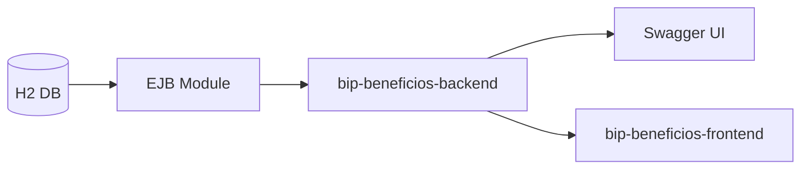

# BIP Beneficios

Solucao fullstack em camadas, banco de dados, modulo EJB, **bip-beneficios-backend** e **bip-beneficios-frontend**, testes e CI.

## Arquitetura



## Stack

- Java 11, Maven 3+
- Spring Boot 2.7, Spring Data JPA, H2
- EJB/JPA no modulo `ejb-module`
- Angular 21
- Swagger/OpenAPI via Springdoc

## Organizacao

```text
bip-beneficios/
  bip-beneficios-backend/   # API Spring Boot
  bip-beneficios-frontend/  # App Angular
  ejb-module/
  db/
```

No backend (`bip-beneficios-backend`), o modulo de beneficios segue:

- `controller`
- `service`
- `repository`
- `dto`
- `model`

Configuracao: `bip-beneficios-backend/src/main/resources/application.yml`

## Como Rodar

### Backend

```powershell
cd c:\bip-beneficios
mvn test
mvn -pl bip-beneficios-backend spring-boot:run
```

A API sobe em `http://localhost:8080`.

- Swagger UI: `http://localhost:8080/swagger-ui.html`
- OpenAPI JSON: `http://localhost:8080/v3/api-docs`

### Frontend

```powershell
cd c:\bip-beneficios\bip-beneficios-frontend
npm install
npm start
```

O Angular sobe em `http://localhost:4200` e usa `proxy.conf.json` para chamar o backend em `http://localhost:8080`.

## Banco de Dados

- `db/schema.sql`
- `db/seed.sql`

Para desenvolvimento local, o backend carrega equivalentes em `bip-beneficios-backend/src/main/resources/schema.sql` e `data.sql`.

## Endpoints Principais

- `GET /api/v1/beneficios`
- `GET /api/v1/beneficios/{id}`
- `POST /api/v1/beneficios`
- `PUT /api/v1/beneficios/{id}`
- `DELETE /api/v1/beneficios/{id}`
- `POST /api/v1/beneficios/transferencias`

## Testes

| Camada | O que cobre |
|--------|-------------|
| `ejb-module` | Saldo, origem=destino, ordem de lock, benefício inativo |
| `bip-beneficios-backend` | Service unitário (CRUD/transferência) + integração MockMvc (CRUD, 404, validação, transferência) |
| `bip-beneficios-frontend` | Componente, validações, máscara BRL, fluxos de modal |

```powershell
cd d:\bip-beneficios
mvn test

cd d:\bip-beneficios\bip-beneficios-frontend
npm test
```

## Correção do bug no EJB

O `BeneficioEjbService` original permitia transferências sem validar saldo nem concorrência. A implementação atual:

- Valida origem/destino, valor positivo e benefícios **ativos**
- Verifica **saldo suficiente** antes de debitar
- Usa `PESSIMISTIC_WRITE` e bloqueia registros sempre na **ordem crescente de ID** (evita deadlock)
- Exceções anotadas com `@ApplicationException(rollback = true)` para reverter a transação

